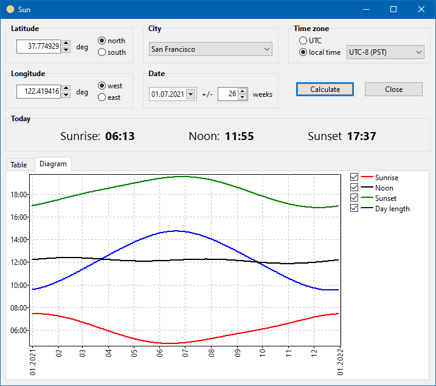

# sunrise
Calculates the times of sunrise, noon and sunset, as well as the day lengths for a series of dates at a given location.

## Credits ##
* Uses the `solar` unit by **Jeff Steinkamp**.
* The application icon was created form the sun png images provided by Icons8 (www.icons8.com)
